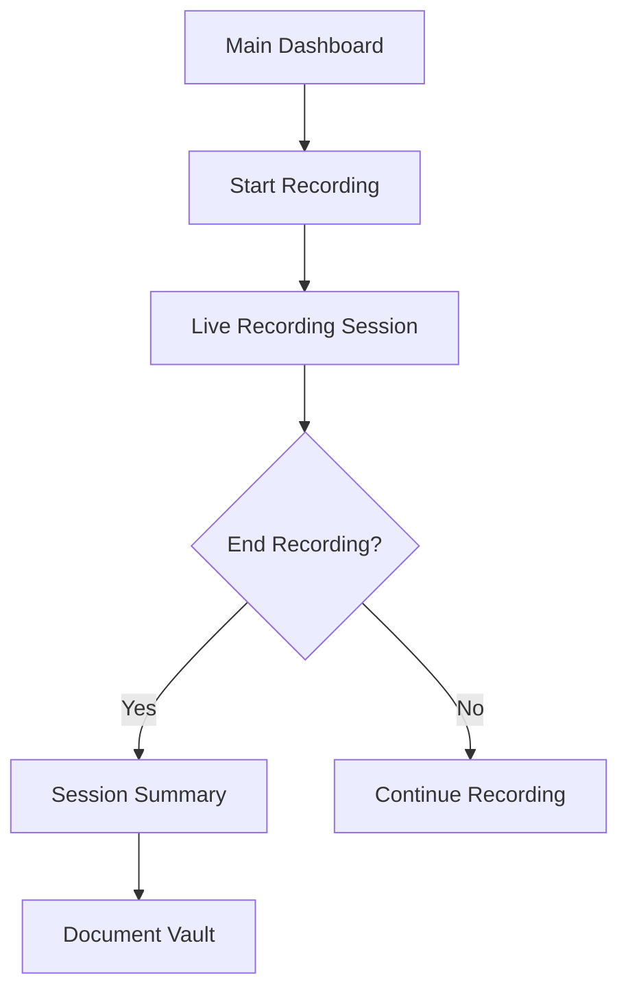
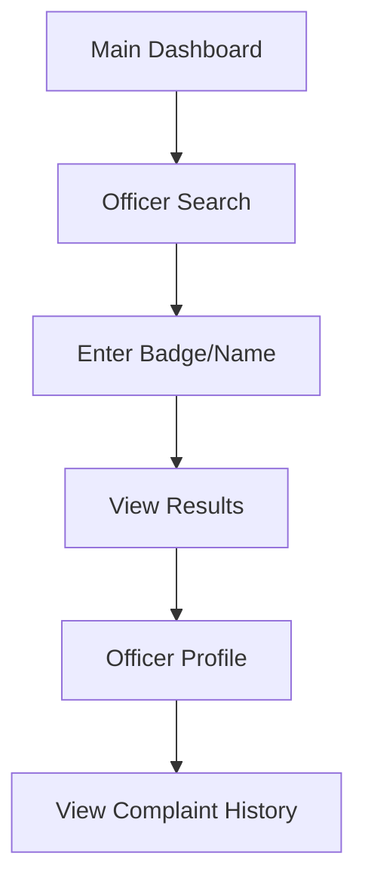

# CopStopper Design System

> **Source**: Stitch Project "copstopredesign"  
> **Project ID**: `13517505834194279732`  
> **Generated**: February 1, 2026  

---

## Design Tokens

### Color Palette

| Token | Value | Usage |
|-------|-------|-------|
| **Primary** | `#197fe6` | Accent color, CTAs, active states |
| **Background** | Dark mode base | All screens use dark theme |
| **Surface** | Elevated cards, modals | Secondary backgrounds |
| **Text Primary** | White/Light | Main text content |
| **Text Secondary** | Muted gray | Labels, timestamps, captions |

### Typography

| Style | Font | Usage |
|-------|------|-------|
| **Font Family** | Inter | All text throughout the app |
| **Headings** | Inter Bold | Screen titles, section headers |
| **Body** | Inter Regular | Content, descriptions |
| **Caption** | Inter Light | Timestamps, metadata |

### Spacing & Radius

| Token | Value |
|-------|-------|
| **Border Radius** | 8px (`ROUND_EIGHT`) |
| **Saturation** | 2 (enhanced vibrancy) |
| **Card Padding** | Consistent inner padding |
| **Section Gaps** | Uniform vertical spacing |

---

## Screen Inventory

The design system spans **10 screens** for a mobile-first police encounter recording application:

### 1. Main Dashboard
- **ID**: `fbd7065c1596425a95f69c1099c0183f`
- **Dimensions**: 390 × 884
- **Purpose**: Primary entry point with quick actions
- **Key Elements**:
  - Recording status indicator
  - Quick-start recording button
  - Recent sessions summary
  - Navigation to other features

### 2. Live Recording Session
- **ID**: `dae2334ba5be477eb306348058ab4716`
- **Dimensions**: 390 × 884
- **Purpose**: Active recording interface
- **Key Elements**:
  - Recording timer/duration
  - Audio waveform visualization
  - Pause/Stop controls
  - Emergency contact alert button

### 3. Officer Search
- **ID**: `b1769119579c4fb1986f4c80625048d1`
- **Dimensions**: 390 × 884
- **Purpose**: Search police database for officer information
- **Key Elements**:
  - Search input field
  - Filter options (badge, name, department)
  - Results list with officer cards
  - Complaint history indicators

### 4. Legal Advice Chat
- **ID**: `7b0f4a7aec3a41d0a820fc87f6c50d06`
- **Dimensions**: 390 × 884
- **Purpose**: AI-powered legal guidance during encounters
- **Key Elements**:
  - Chat message bubbles
  - Quick reply suggestions
  - Rights information cards
  - Share/save conversation options

### 5. Document Vault
- **ID**: `83fb34ea15804e12b73463815e97da5d`
- **Dimensions**: 390 × 1110
- **Purpose**: Secure storage for recordings and documents
- **Key Elements**:
  - File/folder grid layout
  - Upload status indicators
  - Encryption status badges
  - Share/export actions

### 6. Session Summary
- **ID**: `17c3bfdaede54943b87cc3474d9b181a`
- **Dimensions**: 390 × 1267
- **Purpose**: Post-recording session details and transcript
- **Key Elements**:
  - Session metadata (date, duration, location)
  - AI-generated transcript
  - Key moments timeline
  - Export/share options

### 7. App Permissions Onboarding
- **ID**: `c9faeddaa28e480fbc4da999b6857778`
- **Dimensions**: 390 × 901
- **Purpose**: Guide users through required permissions
- **Key Elements**:
  - Permission list with explanations
  - Toggle/grant buttons
  - Skip option
  - Progress indicator

### 8. Collaborative Monitoring
- **ID**: `8507011bdab041bcbda1c025f1387983`
- **Dimensions**: 390 × 906
- **Purpose**: Share live session with trusted contacts
- **Key Elements**:
  - Contact list with live status
  - Invite link generation
  - Real-time viewer count
  - Privacy controls

### 9. Recording History
- **ID**: `8b754f279d384267a1bd60aae9f8be11`
- **Dimensions**: 390 × 884
- **Purpose**: Browse past recording sessions
- **Key Elements**:
  - Session cards with thumbnails
  - Date/time grouping
  - Search/filter bar
  - Bulk actions

### 10. App Settings
- **ID**: `dcf43602a2b344ebbe0299d191daefc6`
- **Dimensions**: 390 × 1043
- **Purpose**: Configure app preferences
- **Key Elements**:
  - Account section
  - Recording preferences
  - Privacy settings
  - Legal/about links

---

## Component Library

### Cards
- Rounded corners (8px)
- Subtle elevation/shadow
- Dark surface color
- Consistent padding

### Buttons
| Type | Style |
|------|-------|
| Primary | Filled with `#197fe6`, white text |
| Secondary | Outlined, transparent background |
| Danger | Red accent for destructive actions |
| Ghost | Text-only, subtle hover state |

### Navigation
- Bottom navigation bar
- Icon + label pattern
- Active state highlighting
- 4-5 primary destinations

### Lists
- Card-based list items
- Leading icons/avatars
- Trailing actions/chevrons
- Swipe gestures for quick actions

### Forms
- Dark input fields with borders
- Floating labels
- Validation states
- Icon prefixes where appropriate

---

## User Flows

### Recording Flow

### Officer Lookup Flow

---

## Implementation Mapping

| Screen | Flutter File |
|--------|-------------|
| Main Dashboard | `lib/src/ui/screens/home_screen.dart` |
| Live Recording | `lib/src/ui/screens/recording_screen.dart` |
| Officer Search | `lib/src/ui/screens/officer_search_screen.dart` |
| Legal Chat | `lib/src/ui/screens/legal_chat_screen.dart` |
| Document Vault | `lib/src/ui/screens/vault_screen.dart` |
| Session Summary | `lib/src/ui/screens/session_detail_screen.dart` |
| Settings | `lib/src/ui/screens/settings_screen.dart` |

---

## Asset Links

| Screen | Screenshot URL |
|--------|---------------|
| Main Dashboard | [View](https://lh3.googleusercontent.com/aida/AOfcidUm9TC2NArcwUzSaUIJ3Eo0tMAc2ubTEQ6mlRl_VYWYIy-aWdyHWyVO7_VCy-v5RYYAi4cuZizZASbM8rRPkxcI8pZC68Hj6IhFIGbk_VUog54Sbh-1StLG-LZMCFlONjjivymEDRd6C1UedqllhLwQn7jPNr4gVc4ONHSCETrJDDpNoXIHbWuBavpFFEPENKGiegbq-1SG9JKrScCIuRUXcvBvya6SgCncxGF0QbAO-s45qJcOwpY3kcBO) |
| Live Recording | [View](https://lh3.googleusercontent.com/aida/AOfcidWEzJb0FND-M6qLs7-0l66zWiVih9Ynj02Gl0tRSWvI1snJrcOMdazHOmgGMpje7-DVKOxt9X-c5GdelU15bb5atHigZQGq_3SOgb8x9Fw7lfYsnNr22KuxDhnQV1ibHO665mGoGB2BxSugzJx-NxU4lZ4al9Zf7JgF-I5xgASxVZY6NOUeLvYcjT9nWPaH9Bu77a8npfb843-I2hS96vQ5-pLKPKunq95gOM6u759kGjJeV6CZ8GZL5oDv) |
| Officer Search | [View](https://lh3.googleusercontent.com/aida/AOfcidUjhc6qtbUXiz9Q89vOhO7HjwtqFl4jGCKAkd1Cgxkba3aZfoOjzC-6ZPyTUjkhK-BO6OIxImAJWe4ohfAKAsXiW48_kCDxrHy9J9-ZRQ_MLkViD0FB9_-GZyxQjXxRotKwkTr5ou_grz6WOpAovgfjJAsFSSuLGolJp_zAo3FiAStP1TQrVGlhrRBzWkdjxGC8wpgAEhpvF_U8XVVZEKihKWR8DSRzNP0NiKzpekfN2dEpl5TwYfXmoXfv) |
| Legal Chat | [View](https://lh3.googleusercontent.com/aida/AOfcidWufGqs3j9eD1VrHVH_VR3hNdlwFLBRLJ_GF4V54NQZ4tZlY-Zo4thVz4pxgd5Z7YVwixf_6dCcu1aQrxfBdrT1g7hEMt8AV_JWk_deDuleCoxyFf8VpzPNrPLeNdJ1dXLM8bsZsqi5CGH22XPnjtypJTqYWSWFvKrkvrDzijbClKw7fK-6SfUKOQA66ZvOZXEdJcwo2Hic0JdMRKFlbDgAlgvIfwP3GiIW9eaMygS6S__u6hj_Mc-3-1I) |
| Document Vault | [View](https://lh3.googleusercontent.com/aida/AOfcidVxwYEz1BpVzcXjUk4mOayHpd-Xtwg-UdxEcCO4FMfnsUukzId_IAlfIdnPsCsdyj5EalfTEpeeT0mcuyyvhpFE2TE6F_qgMawlPBXfN0tQanYLu1A63w6KcuN6YRvk0W66z_4IZQMfW64Yf4d7hBkfZAk7sXcEWFdrHA9JSw3YCsJGNJmfm2dU7J2u76MmyeQnfqDSY89ibd7JGgulfDofR4E39xoMMflKJiYrIv1ZK-p6mxObwoEZgYJK) |
| Session Summary | [View](https://lh3.googleusercontent.com/aida/AOfcidVca7PHxxKaOyJac917gPUXKLGCMP9eZRwpYXa0LgljeZLtuEBcJOHK4Jt9QJHQrMEF4Xu__zmU2v1lCQswmDygt9ArrhcWeK8J2R339Ye3pg_eXDvR7UnH0W3eCJDq9s54FcDFKletzoHnD15W9rx-lnUr2sjV-6KTeQxuxz3Ip-ugSzmH3g9N1oK8VeTcOr1l-i1lkjyuwRFHIqr3dmhA9AlxTSaiaIBUWjXyqxnGmE5cO9bK5-wK3t8) |
| Permissions | [View](https://lh3.googleusercontent.com/aida/AOfcidWLSY2zzMyP5nTYW6pVWkhYV7wFs7pkhla9V_iRjBEkrOdm9LOBs8jeJpvq1FowK1PE4N8soy-amA4jszDR4sLGIIEFc5nryy-_t_o2bEEYgV9olFMin3NuVyxMOKBgKc5AyTn2gTCaCE25gQ47z4YN0vUrKm4u9u-fxmIYtXJcB2tpLHmeEdfi0ZEqXrRxlQJS_gGYOBbroEB1VxGZi2dPPrp1NlgxBLJxoeePe_D4xt9ToIwmONPvldY) |
| Collaborative | [View](https://lh3.googleusercontent.com/aida/AOfcidWIKPygfEdMxmDLl5mHVHyBwWlWITyurvL9FJ0LYXJh-zRJezTnI5CX9KFf1WoO045OHVuiAHr3Euaqi7lZ_-Ak_b6N77Jeagvz5C4-R3TXSYnDVR5md_ohhCkSLrqZW8TOgoqNoG6FIqcmwKuUeVxiAzgSQmAySWS60kSmlapjSmlHto5rzHczyeEtomLMxzKy7jhQs_yAGVi8wMH16i0D3FMzChFY3Z35A1IyEtSYhQE_2VnE4D28vBI) |
| History | [View](https://lh3.googleusercontent.com/aida/AOfcidVeMw8oYg4IDvD3RIfqoAhAnMv9nYmffnpanlpK3VMp6wt4Q2BOrXg5LmXCrpUjU7_jCkGgdk4XSjud1ybTjY6Gpa9O_csAASAKCZ2hS9D5C5V8mWB3hOTlbT9qSh5jlMQCG-P0PRtfZzlVvJitOrB5Nap5j19AzRjtRBwqznFHKcXvLrsfqkjO5j1etNTCJwO4khHs9r-7uvHtW6xEjkviMc3Q3KCileYx1Ul96ZhC2kIDQmRDAmCZcIs) |
| Settings | [View](https://lh3.googleusercontent.com/aida/AOfcidXQoLhRjLhVtxzKnwtJUSv57egI_6t_6G9K5aA8DWW2rxtSMKvbc90qkkIhDVaf1S6fYUaxki1GD1diOhLSIdDbPGxtHAHKLQAu7_XQBIw_hI29AKoKXoeucKxKO5CIajsByTvnqv9PVI5boknAUtfJzggISBvXX0OM7hM4z_Ji0XBJTT2vu5D0iI5gbjO3eboYBA8PXX4YC4SaFUN-DpvbVkPFrk4sRdZE2IaH0VMJT6IBk4jdcXky-91Y) |
